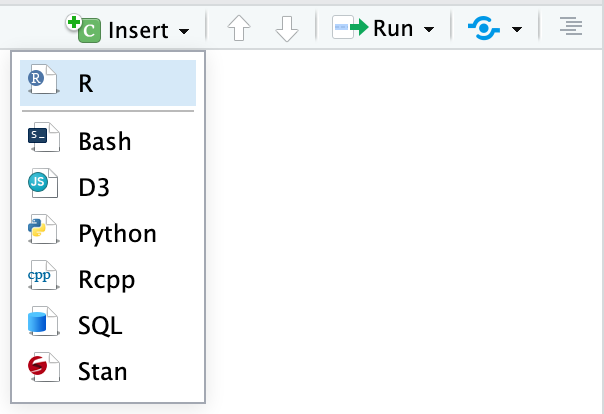

```{r, include=F}
library("knitr")      # for knitting stuff 
library("tidyverse")  # for everything else 
```


> __Note__: I've (very slightly) adapted these tips from [Andrew Heiss](https://www.andrewheiss.com/) who posted them [here](https://evalsp20.classes.andrewheiss.com/reference/rmarkdown/).

[R Markdown](https://rmarkdown.rstudio.com/) is [regular Markdown](/reference/markdown/) with R code and output sprinkled in. You can do everything you can with [regular Markdown](/reference/markdown/), but you can incorporate graphs, tables, and other R output directly in your document. You can create HTML, PDF, and Word documents, PowerPoint and HTML presentations, websites, books, and even [interactive dashboards](https://rmarkdown.rstudio.com/flexdashboard/index.html) with R Markdown. 

The [documentation for R Markdown](https://rmarkdown.rstudio.com/) is extremely comprehensive, and their [tutorials](https://rmarkdown.rstudio.com/lesson-1.html) and [cheatsheets](https://rmarkdown.rstudio.com/lesson-15.html) are excellent—rely on those.

Here are some additional resources: 

- [R Markdown: The Definitive Guide](https://bookdown.org/yihui/rmarkdown/): Free online book about all things R Markdown. 
- [Code chunk options reference](https://yihui.org/knitr/options/): All the things you can do with code chunks. 

Here are the most important things you'll need to know about R Markdown in this class:

# R Markdown 

## Key terms

- **Document**: A Markdown file where you type stuff

- **Chunk**: A piece of R code that is included in your document. It looks like this:

    ````markdown
    `r ''````{r}
    # Code goes here
    ```
    ````

    There must be an empty line before and after the chunk. The final three backticks must be the only thing on the line—if you add more text, or if you forget to add the backticks, or accidentally delete the backticks, your document will not knit correctly.

- **Knit**: When you "knit" a document, R runs each of the chunks sequentially and converts the output of each chunk into Markdown. R then runs the knitted document through [pandoc](https://pandoc.org/) to convert it to HTML or PDF or Word (or whatever output you've selected).

    You can knit by clicking on the "Knit" button at the top of the editor window, or by pressing `⌘⇧K` on macOS or `control + shift + K` on Windows.

```{r knit-button, indent="    ", echo=FALSE, out.width="30%"}
include_graphics("figures/knit-button.png")
```

## YAML Header 

At the top of your RMarkdown file is a YAML (Yet Another Markdown Language) header, like this one: 

```yaml
---
title: Using R Markdown
date: "February 17th, 2020"
author: "Tobias Gerstenberg"
output:
  bookdown::html_document2:
    toc: true
    toc_depth: 4
    theme: cosmo
    highlight: tango
---
```

Some things to note about YAML headers: 

- The indentation of the YAML section matters, especially when you have settings nested under each output type. 
- Make sure not to use `---` anywhere else in your document. If you'd like to have a horizontal line, use at least four dashes like so `----`. 

## Add chunks

There are three ways to insert chunks:

- Press `⌘⌥I` on macOS or `control + alt + I` on Windows

- Click on the "Insert" button at the top of the editor window

```{r insert-chunk, indent="    ", echo=FALSE, out.width="30%"}

```

- Manually type all the backticks and curly braces (don't do this)

## Chunk names

You can add names to chunks to make it easier to navigate your document. If you click on the little dropdown menu at the bottom of your editor in RStudio, you can see a table of contents that shows all the headings and chunks. If you name chunks, they'll appear in the list. If you don't include a name, the chunk will still show up, but you won't know what it does.

```{r chunk-toc, echo=FALSE, out.width="40%"}
include_graphics("figures/chunk-toc.png")
```

To add a name, include it immediately after the `{r` in the first line of the chunk. Names cannot contain spaces, but they can contain underscores and dashes. **All chunk names in your document must be unique.**

````markdown
`r ''````{r name-of-this-chunk, warning=FALSE, message=FALSE}
# Code goes here
```
````

## Use one code chunk per section (or subsection)

For my projects, I always try to have a single code chunk for each section (or subsection). This way, I can use the document outline on the top right to easily navigate between the different code chunks. 

```{r document-outline, echo=FALSE, out.width="50%"}

```

## Chunk options

There are a bunch of different options you can set for each chunk. You can see a complete list in the [RMarkdown Reference Guide](https://rstudio.com/wp-content/uploads/2015/03/rmarkdown-reference.pdf) or at [**knitr**'s website](https://yihui.org/knitr/options/).

Options go inside the `{r}` section of the chunk:

````markdown
`r ''````{r name-of-this-chunk, warning=FALSE, message=FALSE}
## Code goes here
```
````

The most common chunk options are these:

- `fig.width=5` and `fig.height=3` (*or whatever number you want*): Set the dimensions for figures
- `echo=FALSE`: The code is not shown in the final document, but the results are
- `eval=FALSE`: The code cunk is not evaluated (this is a common cause of error as things will work fine in RStudio but not once you try to knit)
- `message=FALSE`: Any messages that R generates (like all the notes that appear after you load a package) are omitted
- `warning=FALSE`: Any warnings that R generates are omitted
- `include=FALSE`: The chunk still runs, but the code and results are not included in the final document

You can also set chunk options by clicking on the little gear icon in the top right corner of any chunk:

```{r chunk-options, echo=FALSE, out.width="70%"}

```

## Inline chunks

You can also include R output directly in your text, which is really helpful if you want to report numbers from your analysis. To do this, use `` `r "\u0060r r_code_here\u0060"` ``.

It's generally easiest to calculate numbers in a regular chunk beforehand and then use an inline chunk to display the value in your text. 

# Style guide 

## Make sure the code runs from top to bottom 

For example, it shouldn't be the case, that you need to run code chunk 2 before running code chunk 1.

## Only use lower case in names 

```{r, eval=FALSE}
# instead of using camelCase
df.Experiment1Analysis 

# use snake_case
df.experiment1_analysis 
```

## I recommend the following convention for naming things 

Personally, I like to name things in a (pretty) consistent way so that I have no trouble finding stuff even when I open up a project that I haven't worked on for a while. I try to use the following naming conventions: 

```{r, echo=FALSE}
name = c("df.thing",
         "l.thing",
         "fun.thing",
         "tmp.thing")
use = c("for data frames",
        "for lists",
        "for functions",
        "for temporary variables")
kable(x = tibble(name, use), 
      caption = "Some naming conventions I adopt to make my life easier.", 
      align = c("r", "l"),
      booktabs = TRUE)
```

This also helps with using `tab` for autocompletion when writing code. 

## Use spaces consistently 

```{r, eval=FALSE}
# instead of this 
ggplot(data=data, 
       mapping=aes(x=x,y=y))

# do this 
ggplot(data = data, 
       mapping = aes(x = x,
                     y = y))
```

## Put function arguments on separate lines 

```{r, eval=FALSE}
# instead of this 
ggplot(data = data, mapping = aes(x = x, y = y))

# do this (particularly when a function has more than 3 arguments)
ggplot(data = data,
       mapping = aes(x = x,
                     y = y))
```

## Use argument names

```{r, eval=FALSE}
# instead of this 
ggplot(data, aes(x, y))

# do this (particularly for functions that aren't used all the time)
ggplot(data = data,
       mapping = aes(x = x,
                     y = y))
```

## Have one heading and one code chunk per plot 

This makes it easier to run and reproduce code (rather than having multiple plots being generated in the same code chunk)

## General structure for RMarkdown files 

I like it if there is just one RMarkdown file per project. Using headings (and the document outline viewer in RSTudio) makes this manageable. 
I suggest the following general structure: 

- Load packages 
- Run helper functions (general settings etc)
- Experiment 1
  - DATA
  - STATS
  - PLOTS
- Experiment 2
  - DATA
  - STATS
  - PLOTS  

In DATA, you load and wrangle the data files. 
In STATS, you run any statistical analysis (fit linear models, find best-fitting parameters, etc.)
In PLOTS, you make all the plots (and again, have one code chunk and subheading per plot). 

# Session info 

```{r}
sessionInfo()
```

